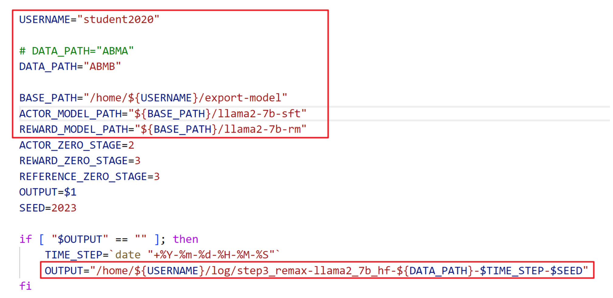

1. Reward Model Training

   1.1 pip install -r llama_factory_requirements.txt

   ​		conda activate llama_factory

   ​		cd LLaMA-Factory-main

   1.2 Download LLaMA2-7b, Qwen1.5-7b, ChatGLM3-6B, Baichuan2-7B to "base-model" folder

   1.3 train reward model and SFT model

   ​	run "train_rm_ABMA.sh" and "train_sft_ABMA.sh" separately.

   ​	run "train_rm_ABMB.sh" and "train_sft_ABMB.sh" separately.

   ​	run "train_rm_multi_role.sh" and "train_sft_multi_role.sh" separately.

   ​	Note: Please remember to modify your username, model type and model path.

   

   1.4 Merge LoRA weight to base model

   ​	run "merge_rm_lora_ABMA.sh" and "merge_sft_lora_ABMA.sh" separately.

   ​	run "merge_rm_lora_ABMB.sh" and "merge_sft_lora_ABMB.sh" separately.

   ​	run "merge_rm_lora_multi_role.sh" and "merge_sft_lora_multi_role.sh" separately.

2. RL Finetuning

​			2.1 pip install -r llm_requirements.txt

​					conda activate llm

​					cd ReMax-master\Remax_rlhf_finetuning

​			2.2 run  bash file 

​					run train_FairRLHF.sh

​					run train_RLHF.sh

​					run train_multi_role_RLHF.sh

​			Note: Please remember to modify your username, data name and model path 

 

3. Predict 

   3.1 conda activate llama_factory

​					cd LLaMA-Factory-main

​			3.2 run do_predict_FairRLHF_Remax_ABMA.sh

​					run do_predict_FairRLHF_Remax_ABMB.sh

​					run do_predict_RLHF_Remax_ABMA.sh

​					run do_predict_RLHF_Remax_ABMB.sh

​					run do_predict_RLHF_Remax_multi_role.sh

​					run do_predict_sft_ABMA.sh

​					run do_predict_sft_ABMB.sh